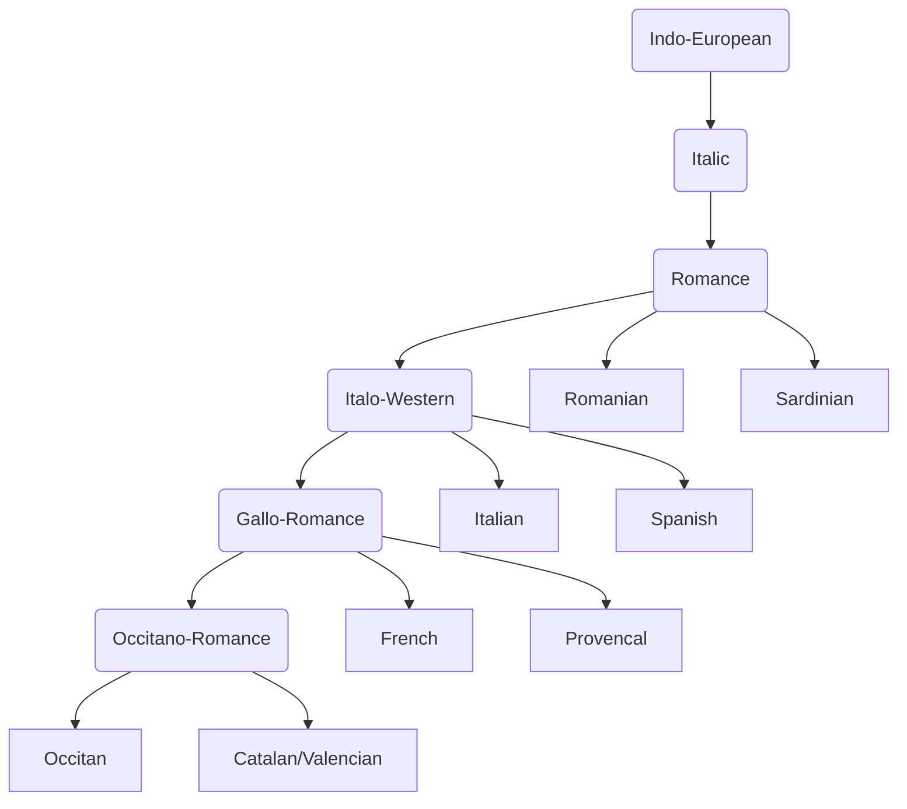

---
aliases:
---
%%
topic:: [[Occitan]]
related:: 
created:: October 22, 2023
last edit:: `$= moment(dv.current().file.mtime.toString()).format("YYYY-MM-DD")`
type:: reference
action:: false
%%

# Contents

# Reference

